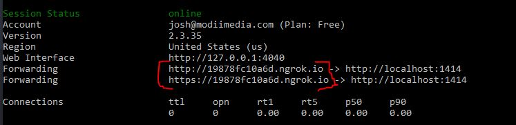
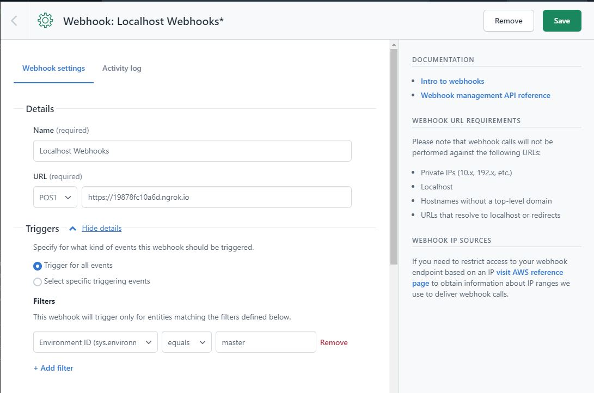

# Contentful Hugo Tailwind Starter

An opinionated Hugo starter project with TailwindCSS, [contentful-hugo](https://github.com/ModiiMedia/contentful-hugo), Typescript, and Webpack

## Prerequisites

Install NodeJS

## Installation

Clone this repo then run the following commands

```bash
# install dependencies
npm install

# initialize contentful-hugo
npx contentful-hugo --init
```

Create a `.env` file following the templated laid out in `.env.example`

## Usage

```bash
# dev server
npm run dev

# production build
npm run build
```

## Getting Live Updates From Contentful in Localhost

_Before following these instructions make sure you have [NGROK](https://ngrok.com/) installed._

After running `npm run dev` you will have your website running at `http://localhost:1313` and the Contentful-Hugo server running at `http://localhost:1414`

Open a new terminal window and run `ngrok http 1414`. This will generate a public url for localhost port 1414.



Copy either the http or the https public URL and use it as a webhook endpoint in Contentful. Make sure the method is set to `POST`. You can have the webhook trigger on all events or specific events.



Bear in mind that this url will change every time you restart NGROK. So you will need to update the webhook URL in Contentful whenever you do this.
